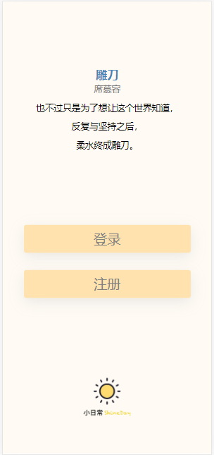

# BingYanInternship
冰岩实习项目

### # 3.20 总结

- 搭了一个前端的项目架构（配置vue-router以及vuex等等）
- 把登录注册页面写好了

- 大概张这样

### # 3.21 总结

- 写完了bottombar以及router切换逻辑
- 写完了三个页面的topbar
- 写完了today的slidedown
- today的habit展示写了一半

### # 3.22 总结

- 基本写完了today页面，遇到了点关于transition的小问题，在导师的帮助下解决了

  在元素不指定宽高的情况下怎么使用transition过渡？答：用max-height。

- 下午晚上基本在看面经。

### # 3.23 总结

- 写完了根据task是否完成改变相应的背景颜色

- 写完了点击task完成打卡的界面

- 写的过程中意识到如果把task的数据放到vuex中会方便很多。。。。。。。（之后再改吧。。痛哭）

- 遇到了个问题记录一下（已解决）

  ​		当一个子组件的display一开始为none，改变display为block的时候，mounted过程中用ref抓取dom元素可能会抓不到，应该是要重新生成dom结点，但是实际上组件已经创建出来了，抓的速度可能比重新生成的dom结点要快一点，就会产生ref显示为undefined

  ​		解决方法：改用visibility即可。

- 写完了打卡成功改变bgc。

- 基本写完了整个today页面的逻辑。可能还有bug，后续发现了再改吧。

- 写完了swiper的大概框架。

- 写完了日常习惯里面的swiper

- 明日TODO：习惯的增删

- 晚上不想写了 眼睛太酸了。。。看一会node视频。。。

- 晚上面了一家实习，之后看了下mongodb的基本增删改查和node入门。快熄灯了。

### # 3.24 总结

- 上午上课，下午去医院配了点药，上午下午项目没进展。
- 晚上看了会express，mongodb
- 想了很久删除的滑动应该怎么做，没想好，今天基本没进展orz。
- 算了 想了想不能这么懒，没学会node，就整赶紧整了一个滑动删除的动画。过程比较艰辛，为了从简，我让滑动操作简化为点击操作，因为vue原生没有带滑动的监听器，还得自己实现一遍，之后又遇到了删除图标的定位问题，一开始想让删除的图标在task组件里，然后写着写着意识到如果transform task组件的话，删除图标也跟着transform了，然后又把task放进了上一级组件。然后又遇到了问题，我根据index来控制要transform哪一个task，但是我下意识地用了document来抓取dom结点（别问我为什么不用ref，我也不知道），一开始好好的，但是切换到其他时间的时候，发现transform没效果了，然后debug了半天，发现document抓取的dom结点把全部的task都抓来了，而我的index还是当前页面的index，也就是说我点击了午间的第一个task，其实transform了全部里面的第一个task。然后解决方案就是用ref来抓取dom结点。

### # 3.25 总结

- 下午都在看express和mongodb以及mongoose，研究了一下一个express项目的基本架构，然后学会了基本的crud。
- 在写增加新的习惯的时候，写到图标scroll的时候，突然意识到昨天的删除其实也可以用overflowscroll来做。。。之后有时间的话在改吧。。。
- 晚饭前写到了新的习惯的页面中的选择图标。
- 饭后在校园里逛了一圈，回来后8点了，开始写代码
- 在写选中图标和颜色的时候，选中之后应该加一个border，但是加上border之后，元素的宽高会发生变化，导致元素重新排列了。然后突然想到能不能用boxshadow来代替border的效果呢，实际操作下来是完全ok的！而且不会导致元素大小发生变化而重新排列！
- 熄灯前写完了habit的增加操作。明天准备上个后台吧，但是那个连续打卡几天的还没想好数据库怎么做，感觉比较麻烦，如果只是坚持了几天了还可以，要连续打卡多少天感觉比较难。
- 